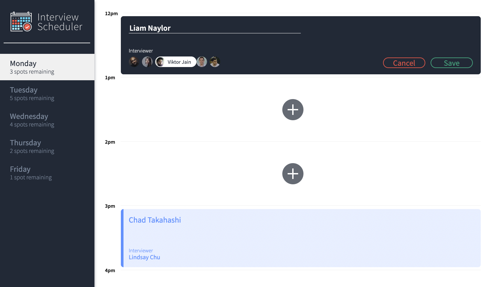

# Interview Scheduler

Your trusty companion for booking interviews!

## Stack

- Frontend: React
- Backend: Express
- Database: PostgreSQL
- Testing: Storybook, Jest and Cypress



## Setup

Install dependencies with `npm install`.

## Running Webpack Development Server

```sh
npm start
```

## Running Jest Test Framework

```sh
npm test
```

## Running Storybook Visual Testbed

```sh
npm run storybook
```

## Running Cypress Visual Testbed

1. Run API server in test mode:
```
npm run test:server
```
2. Send a GET request to reset the DB:
```sh
curl http://localhost:8001/api/debug/reset
```
3. Run Cypress:
```sh
npm run cypress
```
